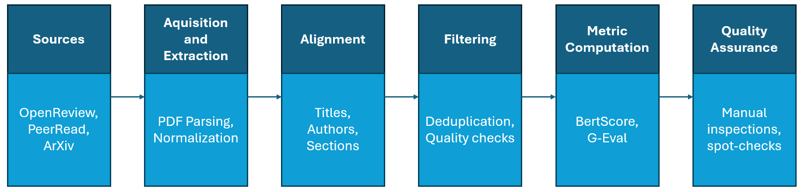
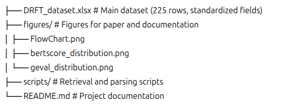
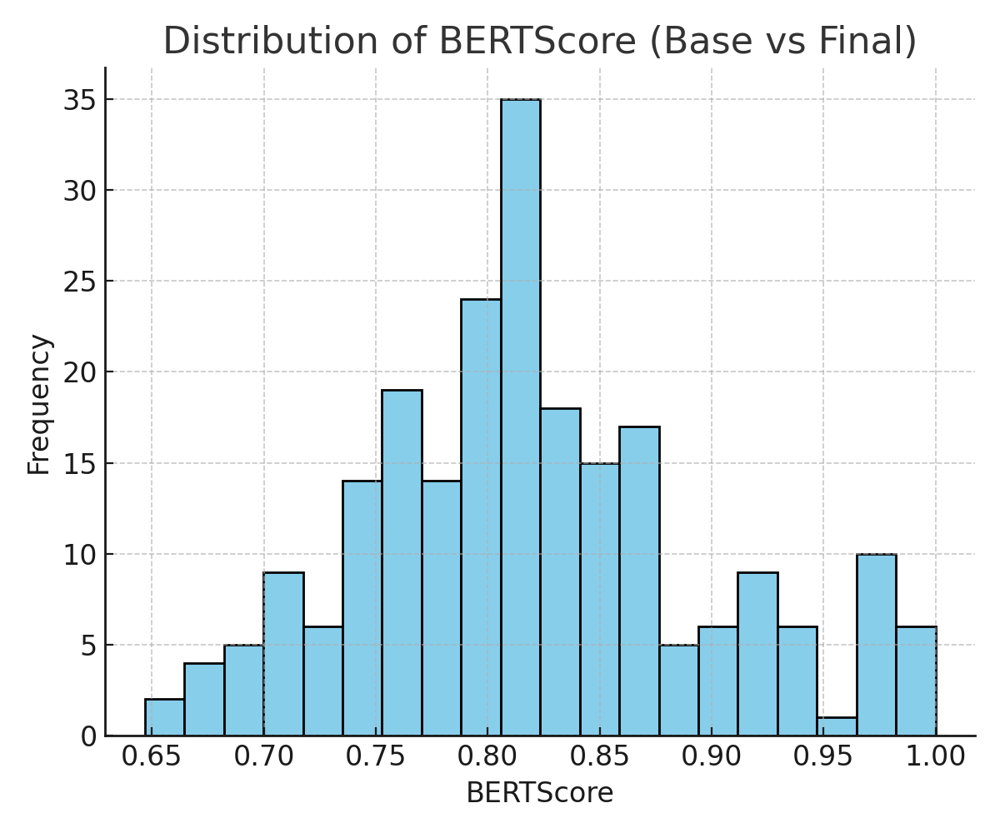
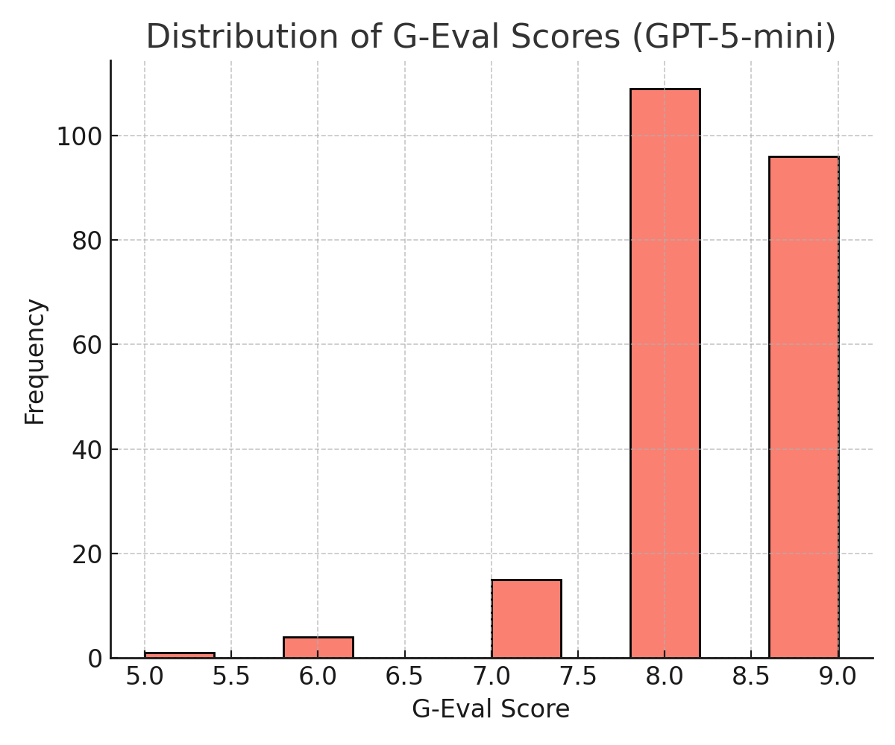

# DRFT: Draft–Review–Final Triples Dataset

[](https://creativecommons.org/licenses/by/4.0/)
[](link_para_o_paper_se_disponivel)

## 📌 Overview
**DRFT (Draft–Review–Final Triples)** is a curated dataset of **225 triplets** that capture the **peer-review cycle** in scientific publishing.  
Each instance contains:
- The **initial draft** (submission)
- The **peer reviews** (concatenated comments and/or meta-review)
- The **final published version** (arXiv)

The dataset is distributed as a single `.xlsx` file with standardized schema and evaluation signals.



---

## 📊 Key Features
- **225 aligned draft–review–final triplets** (ICLR + PeerRead).
- **Two automatic metrics** included:
  - **BERTScore** (draft ↔ final) – semantic preservation
  - **G-Eval** (review → final, GPT-5o-mini) – review uptake with justification
- **Compact, high-value benchmark** for:
  - Review-conditioned edit planning
  - Evaluating automatic revisions vs. human finals
  - Analyzing review facets and revision magnitude

---

## 📂 Repository Structure



---

## 📝 Schema (Fields)
Each row in the `.xlsx` dataset contains:

- **base_text** → Full text of the initial submission  
- **review** → Concatenated peer-review comments/meta-review  
- **final_text** → Final version (arXiv)  
- **source** → Data source (ICLR/OpenReview, PeerRead)  
- **bertscore** → Semantic similarity score (draft ↔ final)  
- **g_eval_score** → Review uptake score (1–10)  
- **g_eval_justification** → Short justification generated by GPT-5o-mini  

---

## 📈 Corpus Statistics
- **Base text length (tokens):** mean ≈ 4700  
- **Final text length (tokens):** mean ≈ 4600  
- **BERTScore:** mean ≈ 0.82  
- **G-Eval:** mean ≈ 8.31  
- **Correlation:** r ≈ –0.33 (complementarity between metrics)

<p align="center">
  
</p>

<p align="center">
  
</p>


---

## 🔧 Usage
Typical research use cases include:
1. **Review-conditioned edit planning**  
   Generate structured edit plans based on review feedback.  
2. **Evaluating automatic revisions**  
   Benchmark against human final versions using BERTScore + G-Eval.  
3. **Analyzing review facets**  
   Study how specific feedback drives textual changes.

---

## 📜 How to Load the Dataset
We provide a helper script [`drft_loader.py`](scripts/drft_loader.py) to make it easy to load the dataset into a pandas DataFrame.

### Example:
```python
from scripts.drft_loader import load_drft_dataset

# Load the dataset
df = load_drft_dataset("DRFT_dataset.xlsx")

# Explore
print(df.shape)
print(df.head())

---

## ⚖️ Ethical and Legal Considerations
- All materials are **publicly available** (ICLR/OpenReview, PeerRead, arXiv).  
- Reviewer anonymity is preserved.  
- Redistribution respects platform terms: where redistribution is restricted, stable IDs and retrieval scripts are provided.  
- **Intended use:** research on review-grounded rewriting, revision quality, and review uptake.  
- **Out of scope:** acceptance prediction, reviewer scoring, deanonymization, or private inference.  

---

## 📚 Citation
If you use **DRFT** in your research, please cite:

```bibtex
@misc{carneiro2025drft,
  title     = {DRFT: A Corpus of Draft--Review--Final Triples for Modeling and Evaluating the Peer-Review Cycle},
  author    = {Leandro Dias Carneiro and Flávio de Barros Vidal},
  year      = {2025},
  howpublished = {GitHub repository},
  url       = {https://github.com/ldiascarneiro/DRFT-dataset}
}
